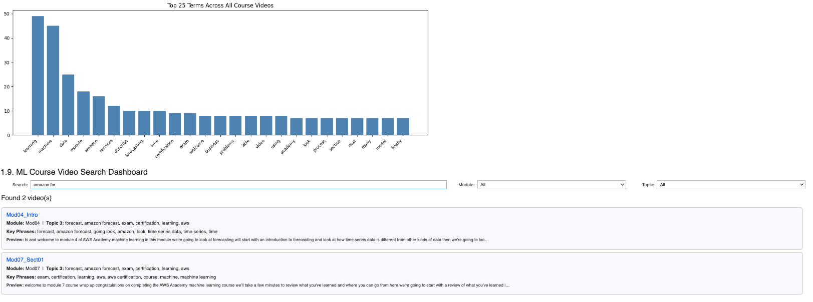

# AWS ML Capstone — Video Content Search Dashboard
 
> **AWS Academy Graduate: Machine Learning for Natural Language Processing**
> Capstone project for the AWS Academy ML for NLP course.
 
---
 
## Project Overview
 
This capstone builds an end-to-end NLP pipeline that transcribes, normalizes, and indexes **46 machine learning course videos**, then surfaces them through an **interactive search dashboard** — so students can instantly find relevant content by topic or keyword.
 
---
 
## Dashboard Preview
 
> **Note:** The live dashboard runs inside an **AWS Academy SageMaker notebook session**, which is time-limited. The S3 bucket, IAM roles, and compute environment are provisioned per-session and are automatically torn down when the lab ends — so the interactive version cannot be preserved as a static file. The screenshot below shows the dashboard running during the active lab session.
 

 
The dashboard includes:
- **Keyword search** across all 46 transcribed videos (with live transcript preview)
- **Module filter** to narrow by course section (Modules 1–7)
- **Topic filter** based on Amazon Comprehend topic modeling (10 topics)
- **Top 25 terms bar chart** visualizing the most frequent terms across the entire corpus
---
 
## 🏗️ Pipeline Architecture
 
```
46 Course Videos (S3)
        │
        ▼
┌─────────────────────────────┐
│  Speech-to-Text (local)     │  ffmpeg (audio extraction)
│  + SpeechRecognition lib    │  → Google Speech API (fallback)
│  [Amazon Transcribe was     │    used because Transcribe
│   blocked by lab IAM role]  │    permissions were restricted
└──────────────┬──────────────┘
               │  46 raw transcripts → S3 (transcripts/)
               ▼
┌─────────────────────────────┐
│  Text Normalization (NLTK)  │  Lowercase → remove punctuation
│                             │  → tokenize → remove stopwords
│                             │  → lemmatize
└──────────────┬──────────────┘
               │  46 normalized docs → S3 (normalized/)
               ▼
┌─────────────────────────────┐
│  Amazon Comprehend          │  StartTopicsDetectionJob
│  Topic Modeling             │  → 10 topics (doc-topics.csv
│                             │     + topic-terms.csv)
└──────────────┬──────────────┘
               │
               ▼
┌─────────────────────────────┐
│  Interactive Dashboard      │  ipywidgets + matplotlib
│  (Jupyter Notebook)         │  Keyword search + topic filter
└─────────────────────────────┘
```
 
---
